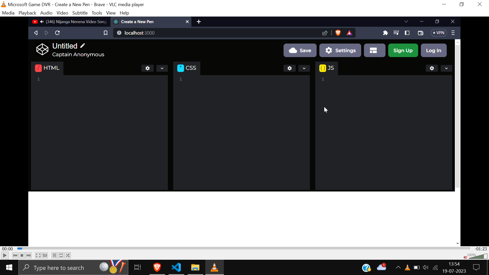

## Codepen Code Editor Clone Using ReactJs

TechStack
- HTML
- CSS
- ReactJs
- Material UI
- Github (For Version Control)

## Codepen-Clone
* CodePen Editor is a popular online code editor that allows developers to write HTML, CSS, and JavaScript code snippets in a browser-based environment. It provides a user-friendly interface with separate panels for code input and live output, making it easy to experiment and see immediate results.
* CodePen Editor is a go-to tool for web developers, designers, and learners alike. Its intuitive interface, robust feature set, and social aspect make it a valuable resource for code experimentation, prototyping, and showcasing one's coding skills.

Learnings from this projects:-
* React Fundamentals
* What is CodeMirror Library and Usage of Library.
* What is Splitplane library and Usage of Library.
* Fundamentals Of Material UI Library.

### Note
* The reason of not hosting this web app is due to the conflicts of the dependency of codemirror that it doesn't support react version >17 and mui doesn't support version <16.
* Due to this reasons unfortunately i wasn't able to host this application.(PS: I tried debugging for this issues but at the end I couldn't host it.), but you can try hands on experience of this app by just making a clone of this repository and npm i command.

### Demo Of Codepen-Clone

